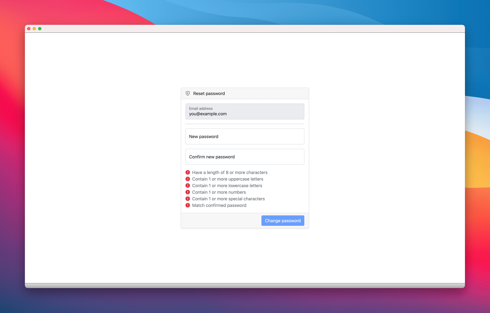
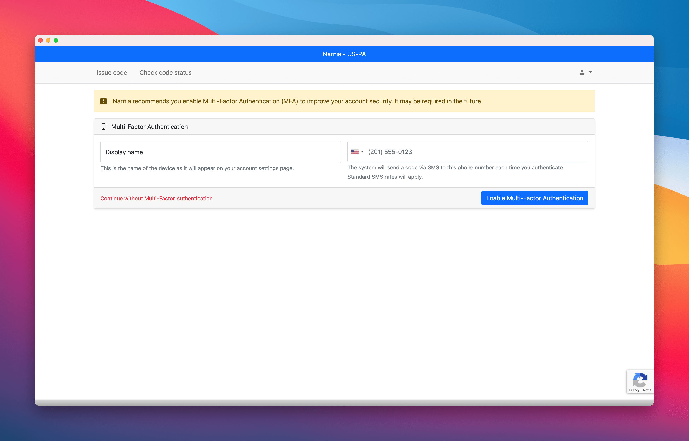
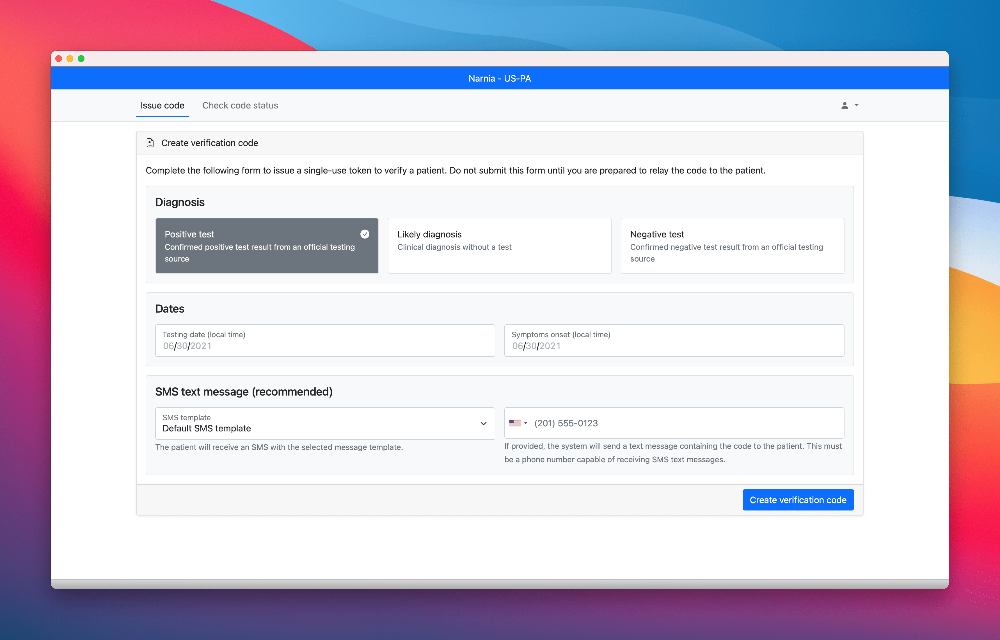
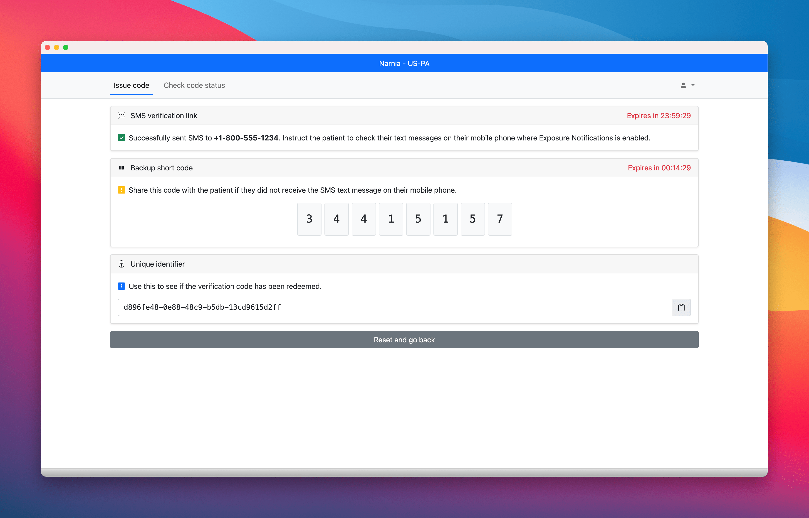
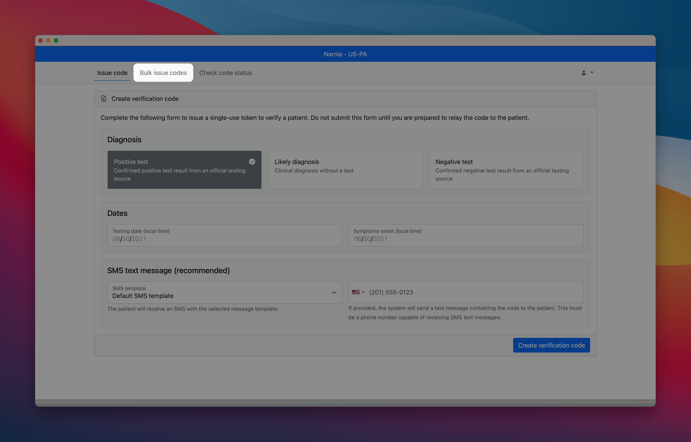
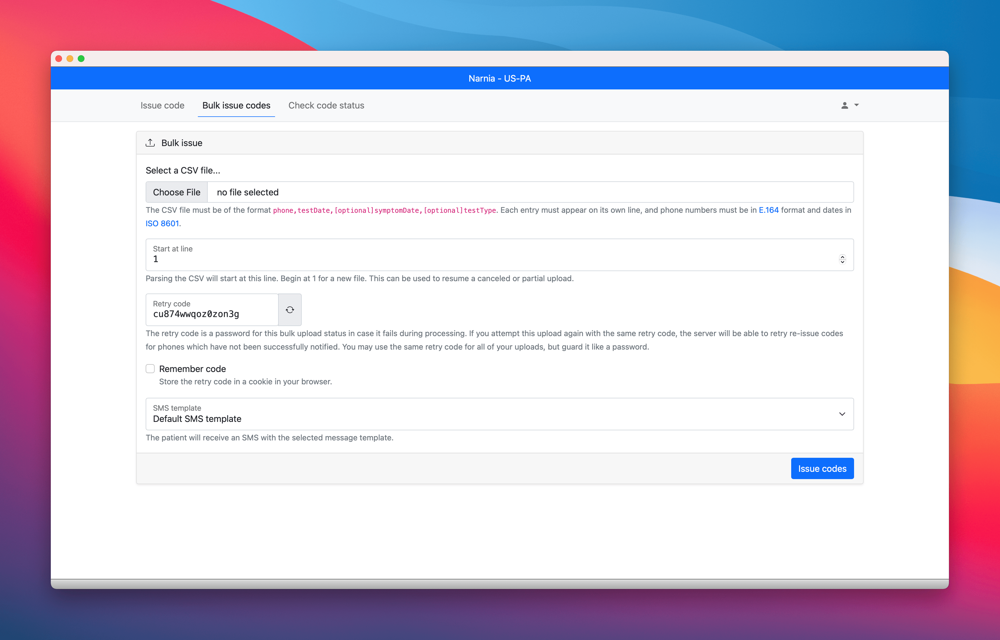
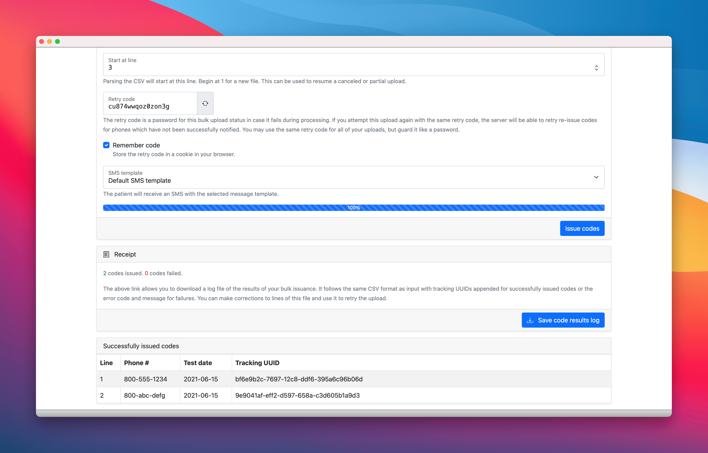

- [Case worker (code issuer) guide](#case-worker-code-issuer-guide)
  - [Account setup](#account-setup)
    - [Second factor authentication](#second-factor-authentication)
  - [Issuing verification codes](#issuing-verification-codes)
  - [Bulk issue verification codes](#bulk-issue-verification-codes)
    - [CSV Format](#csv-format)
    - [Fields](#fields)
      - [Select a file](#select-a-file)
      - [Start at line](#start-at-line)
      - [Retry code](#retry-code)
      - [Remember code](#remember-code)
    - [After processing](#after-processing)

# Case worker (code issuer) guide

This is a high-level guide that can be used as a basis for creating a user guide
for an individual public health authority that is using the verification server.

## Account setup

An administrator of your realm must invite you to join.
Expect to receive an email for a new account / password reset.
This will provide a link to set up your account password.

### Second factor authentication

On your next login, you will be given the option to enroll a second factor for authentication (SMS sent to your mobile phone). It is highly recommended to enroll in a second factor. It can be helpful to set up multiple different phone numbers as backups for the second factor.

## Issuing verification codes

To issue a verification code

1. Select the test type (for EN Express areas, 'Positive test' is the only type available).

2. Enter the test date or symptom onset date or COVID-19 test date.

3. __optional__: Enter the patient's phone number. If entered, this will send them an SMS with the verification code.

    * _If this functionality is not available in your area, the input field will not be shown._

4. Click the `Create verification code` button.

After the code is successfully issued, the `short code` will be displayed to be read over the phone to the patient.

The unique identifier can be used later to confirm if the verification code was used or not.

## Bulk issue verification codes

If [enabled in the realm](/docs/realm-admin-guide.md#bulk-issue-codes), there will be a menu option to bulk issue codes.

This allows the user to upload a .csv file and issue many codes at once to a list of patient phone numbers and their associated test date. The bulk uploader assumes that all results are `positive`.

The bulk uploader is written as a javascript client. Rather than uploading the file, it parses on the client and makes requests to the issue API. This allows the server to discard phone numbers after sending the SMS without storing them. The uploader may be canceled and resumed, respects the server's rate-limiting throttle, and prevents the user from sending an SMS to the same phone twice using a retry code.

### CSV Format
`patient phone`,`test date`, [optional] `symptom date`

* The patient phone must be in [E.164 format](https://www.twilio.com/docs/glossary/what-e164).
* All dates must be in [ISO-8601 format](https://www.iso.org/iso-8601-date-and-time-format.html).

### Fields
#### Select a file
Select .CSV file in the format: phone, symptom-date

#### Start at line
Select a line to start at. This defaults to 0 for a new file, but allows the upload to resume if it fails or is canceled in the middle.

#### Retry code
The user is provided a unique retry-code, although the user may alternatively enter their own, memorable, unique string. If the user is resuming a previous upload, they should enter the retry-code that was used for that upload.

This code is a unique string which is used to one-way hash each phone number to a UUID which is then stored for tracking purposes. This prevents the server from sending an SMS to the same phone number twice if a .CSV is uploaded with the same retry-code. The server will respond with status `Conflict` if it receives the same UUID more than once. The user should keep the value of their retry-code a secret, so that no other user can discover if a phone number has been used by the system.

#### Remember code
This checkbox to saves the retry code as a browser cookie for 1 day. Alternatively you may remember the retry-code yourself.

### After processing
After processing, a message will appear at the top with the count of successfully issued codes and a count of failures. If there are errors, they will be presented in a table with the line number of the failure and the error message received. The user may correct the entries and retry the failed lines.

