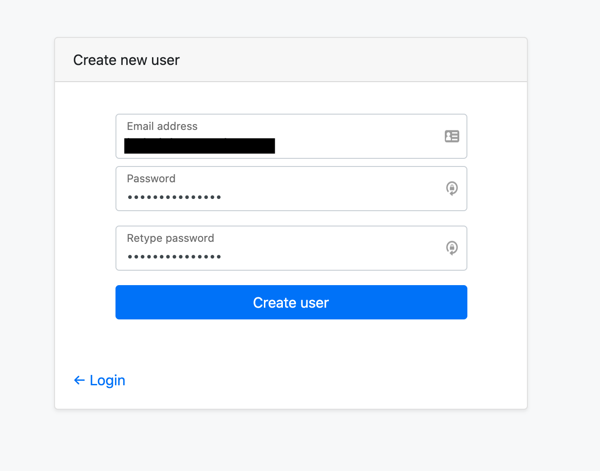
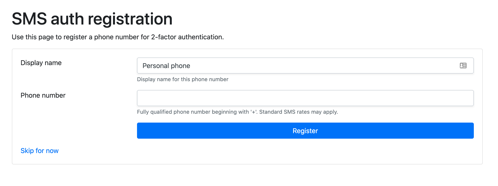
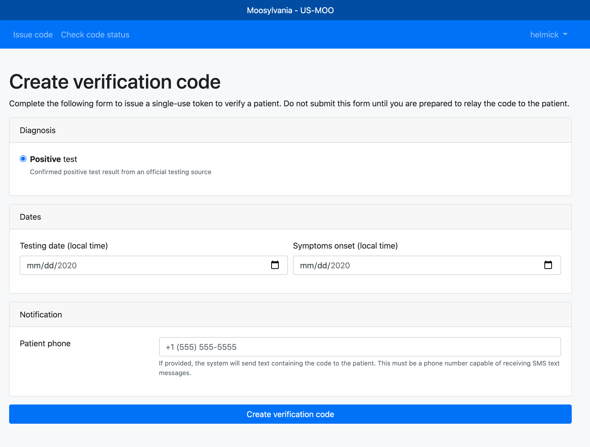
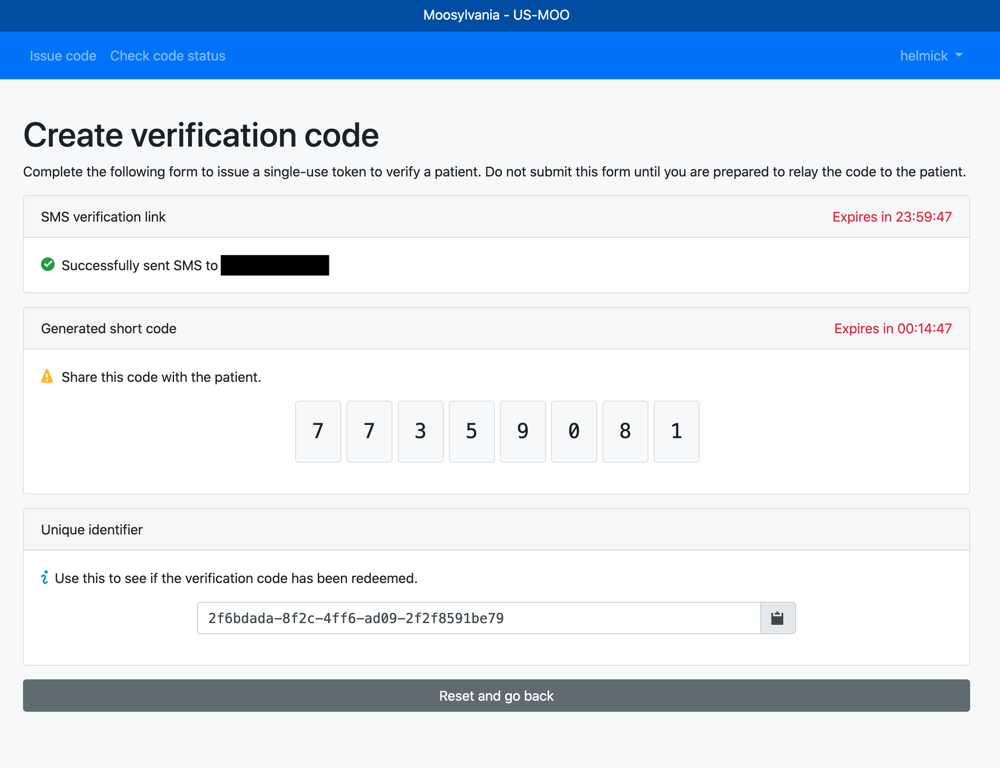

# Code issuer user guide

This is a high-level guide that can be used as a basis for creating a user guide
for an individual public health authority that is using the verification server.

## Account setup

An administrator of your realm must invite you to join.
Expect to receive an email for a new account / password reset.
This will provide a link to set up your account password.

### Second factor authentication

On your next login, you will be given the option to enroll a second factor for authentication (SMS sent to your mobile phone). It is highly recommended to enroll in a second factor. It can be helpful to set up multiple different phone numbers as backups for the second factor.

## Issuing verification codes

To issue a verification code

1. Select the test type (for EN Express areas, 'Positive test' is the only type available).

2. Enter the symptom onset date or COVID-19 test date.

    * Both of these dates are optional but should be entered if they are known.

3. __optional__: Enter the patient's phone number. If entered, this will send them an SMS with the verification code.

    * _If this functionality is not available in your area, the input field will not be shown._

4. Click the `Create verification code` button.

After the code is successfully issued, the `short code` will be displayed to be read over the phone to the patient.

The unique identifier can be used later to confirm if the verification code was used or not.

