# Production

This page includes helpful tips for configuring things in production.

<!-- TOC depthFrom:2 depthTo:2 -->

- [Key management](#key-management)
- [Observability (tracing and metrics)](#observability-tracing-and-metrics)
- [User administration](#user-administration)
- [Rotating secrets](#rotating-secrets)
- [SMS with Twilio](#sms-with-twilio)
- [Identity Platform setup](#identity-platform-setup)
- [End-to-end (e2e) test runner](#end-to-end-e2e-test-runner)
- [Architecture](#architecture)

<!-- /TOC -->

## Key management

The default production key management solution is [Google Cloud KMS][gcp-kms].
If you are using the Terraform configurations, the system will automatically
bootstrap and create the key rings and keys in Cloud KMS. If you are not using
the Terraform configurations, follow this guide to create the keys manually:

1.  Create a Google Cloud KMS key ring

    ```sh
    gcloud kms keyrings create "en-verification" \
      --location "us"
    ```

    Note that the "us" location is configurable. If you choose a different
    location, substitute it in all future commands.

1.  Create two signing keys - one for tokens and one for certificates:

    ```sh
    gcloud kms keys create "token-signing" \
      --location "us" \
      --keyring "en-verification" \
      --purpose "asymmetric-signing" \
      --default-algorithm "ec-sign-p256-sha256" \
      --protection-level "hsm"
    ```

    ```sh
    gcloud kms keys create "certificate-signing" \
      --location "us" \
      --keyring "en-verification" \
      --purpose "asymmetric-signing" \
      --default-algorithm "ec-sign-p256-sha256" \
      --protection-level "hsm"
    ```

    Note the "us" location is configurable, but the key purpose and algorithm
    must be the same as above.

1.  Create an encryption key for encrypting values in the database:

    ```sh
    gcloud kms keys create "database-encrypter" \
      --location "us" \
      --keyring "en-verification" \
      --purpose "encryption" \
      --rotation-period "30d" \
      --protection-level "hsm"
    ```

1.  Get the resource names to the keys:

    ```sh
    gcloud kms keys describe "token-signing" \
      --location "us" \
      --keyring "en-verification"
    ```

    ```sh
    gcloud kms keys describe "certificate-signing" \
      --location "us" \
      --keyring "en-verification"
    ```

    ```sh
    gcloud kms keys describe "database-encrypter" \
      --location "us" \
      --keyring "en-verification"
    ```

1.  Provide these values as the `TOKEN_SIGNING_KEY`, `CERTIFICATE_SIGNING_KEY`,
    and `DB_ENCRYPTION_KEY` respectively in the environment where the services
    will run. You also need to grant the service permission to use the keys.


## Observability (tracing and metrics)

The observability component is responsible for metrics. The following
configurations are available:

| Name                    | `OBSERVABILITY_EXPORTER` value  | Description
| ----------------------- | ------------------------------- | -----------
| OpenCensus Agent        | `OCAGENT`                       | Use OpenCensus.
| Stackdriver\*           | `STACKDRIVER`                   | Use Stackdriver.


## User administration

There are two types of "users" for the system:

-   **System administrator** - global system administrators are the IT
    administrators of the system. They can create new realms and edit global
    system configuration. System admins, however, do not have permissions to
    administer codes or perform realm-specific tasks beyond their creation.
    Typically a system administrator creates a realm, adds the initial realm
    admin, then removes themselves from the realm.

-   **Realm users** - users have membership in 0 or more realms, and their
    permissions in the realm determine their level of access. Most users will
    only have permission to issue codes. However, some users will have control
    over administering the realm, viewing statistics, inviting other realm
    users, or updating realm settings. See the [realm administration
    guide](realm-admin-guide.md) for more information.

When bootstrapping a new system, a default system administrator with the email
address "super@example.com" is created in the database. This user is **NOT**
created in Firebase. To bootstrap the system, log in to the Firebase console and
manually create a user with this email address and a password, then login to the
system. From there, you can create a real user with your email address and
delete the initial system user.


## Rotating secrets

This section describes how to rotate secrets in the system.

### Cookie keys

**Recommended frequency:** automatic

Cookie keys are automatically rotated every 30 days. The rotation gracefully
allows the old secret to phase out.


### Database encryption keys

**Recommend frequency:** 90 days, on breach

**If you are using Google Cloud KMS with the provided Terraform configurations,
this rotation happens automatically!**

These keys control application-layer encryption of secrets before they are
stored in the database. For example, this key encrypts Twilio credentials so
they are not in plaintext in the database. Note that we only use the encryption
key where encryption is appropriate. For API keys and tokens, we HMAC the values
as their plaintext values are not required.

To rotate the encryption keys, rotate them in the underlying key manager. Note
that old entries will still be encrypted with the old key. You do not need to
upgrade them so long as the older key version is still available in your key
manager.

While unlikely, this may require you to update the `DB_ENCRYPTION_KEY`
environment variable.


### API Key signature HMAC keys

**Recommended frequency:** automatic

This key is used as the HMAC secret when signing API keys. API keys are signed
and verified using this value.

Removing any of the keys from this list will invalidate API keys signed by that
version.


### API Key database HMAC keys

**Recommended frequency:** automatic

This key is used as the HMAC secret when saving hashed API keys in the database.

Removing any of the keys from this list will invalidate API keys HMACed by that
version.


### Verification Code database HMAC keys

**Recommended frequency:** automatic

This key is used as the HMAC secret when saving verification codes in the
database.

Removing any of the keys from this list will invalidate verification codes
HMACed by that version. However, given verification a verification code's
lifetime is short, it is probably safe to remove the key beyond 30 days.


### Token signing keys

**Recommended frequency:** automatic

The system automatically rotates token signing keys every 30 days.

When bootstrapping a new system from scratch, it can take up to 5 minutes for
the initial token signing key to become available. To expedite this process, you
can manually invoke the `rotation` scheduler job:

```sh
gcloud scheduler jobs run "rotation" \
  --project "${PROJECT_ID}"
```


### Certificate signing keys

**Recommended frequency:** on demand

If you are using system keys, the system administrator will handle rotation. If
you are using realm keys, you can generate new keys in the UI.


### Cacher HMAC keys

**Recommended frequency:** 90 days, on breach

This key is used as the HMAC key to named values in the cacher. For example, API
keys are cached in the cacher for a few minutes to reduce load on the database.
We do not want the cacher to have plaintext API keys, so the values are HMACed
before being written (and HMACed on lookup). This prevents a server operator
with access to the cacher (e.g. Redis) from seeing plaintext data about the
system. The data is hashed instead of encrypted because we only need a
deterministic value to lookup.

To generate a new key:

```sh
openssl rand -base64 128 | tr -d "\n"
```

Use this value as of the `CACHE_HMAC_KEY` environment variable:

```sh
CACHE_HMAC_KEY="RBwXRppIqscSWxSsP/e52AsPsab4jW7lL5DJSw3uZfTbwgGXj3IV/iWx0ZGjyvY0GB3kupK7qbaDZBGsxxqABT4thujJkx6kAiAabH4kz5qPwoPNGK2M9KW9TX5jM3dnX7smPzlL+Hg8ijxczceDCeQF44cys+3rdWaDdC6kHec="
```

Note: Changing this value will invalidate any existing caches. Most caches are
small and are automatically re-built on demand, so occasional rotation is likely
fine for this system.


### Rate limit HMAC keys

**Recommended frequency:** 90 days, on breach

This key is used as the HMAC key to named values in the rate limit. For example,
API keys and IP addresses are rate limited. We do not want the rate limiter to
have those values in plaintext, so the values are HMACed before being written
(and HMACed on lookup). This prevents a server operator with access to the rate
limiter (e.g. Redis) from seeing plaintext data about the system. The data is
hashed instead of encrypted because we only need a deterministic value to
lookup.

To generate a new key:

```sh
openssl rand -base64 128 | tr -d "\n"
```

Use this value as of the `RATE_LIMIT_HMAC_KEY` environment variable:

```sh
RATE_LIMIT_HMAC_KEY="43+ViAkv7uHYKjsXhU468NGBZrtlJWtZqTORIiY8V6OMsLAZ+XmUF5He/wIhRlislnteTmChNi+BHveSgkxky81tpZSw45HKdK+XW3X5P7H6092I0u7H31C0NaInrxNxIRAbSw0NxSIKNbfKwucDu1Y36XjJC0pi0wlJHxkdGes="
```


## SMS with Twilio

The verification server can optionally be configured to send SMS messages with
app deep-links for the verification codes. This removes the need for a case
worker to dictate a code over the phone, but requires the use of [Twilio](https://twilio.com) to
send SMS text messages. To get started:

1.  [Create an account on Twilio](https://www.twilio.com/try-twilio).

1.  [Purchase](https://support.twilio.com/hc/en-us/articles/223135247-How-to-Search-for-and-Buy-a-Twilio-Phone-Number-from-Console)
    or
    [transfer](https://support.twilio.com/hc/en-us/articles/223179348-Porting-a-Phone-Number-to-Twilio)
    a phone number from which SMS text messages will be sent.

    Note: To reduce the chance of your SMS messages being flagged as spam, we
    strongly recommend registering a toll-free SMS number or SMS short code.

1.  Find your Twilio **Account SID** and **Auth token** on your [Twilio dashboard](https://twilio.com/dashboard).

1.  Go to the realm settings page on the **SMS** tab, enter these values, and
    click save.

1.  Case workers will now see an option on the **Issue code** page to enter a
    phone number. This is _always_ optional in case the patient does not have an
    SMS-enabled cell phone.

[gcp-kms]: https://cloud.google.com/kms

## Identity Platform setup

The verification server uses the Google Identity Platform for authorization.

1. Visit the [Google Identity Platform MFA](https://console.cloud.google.com/customer-identity/mfa) page. Ensure the identity platform is enabled for your project and ensure 'Multi-factor-authorization' is toggled on. Here you may also register test phone numbers for development.

2. Navigate to https://firebase.corp.google.com/u/0/project/{your project id}/authentication/emails to modify the email templates sent during password reset / verify email. Customize the link to your custom domain (if applicable) and direct it to '/login/manage-account' to use the custom password selection. You may also customize the text of the email if you wish.

3. Visit [Google Identity Platform Settings](https://console.cloud.google.com/customer-identity/settings) and ensure that 'Enable create (sign-up)' and 'Enable delete' are unchecked. This system is intended to be invite-only and these flows are handled by administrators.

## Setup system emails

The verification server is capable of sending email through a Google Workspace SMTP relay. You must have administrator permissions on the Google Workspace Account to enable this setting. More detailed instructions are available in the [Google Workspace SMTP relay documentation](https://support.google.com/a/answer/2956491).

1. Visit https://admin.google.com and authenticate as a Google Workspace administrator account.

1. From the sidebar, navigate to `Apps > Google Workspace > Gmail` and then click on the `Routing` box.

1. Scroll down to the "SMTP relay service" option and click `Configure`.

    1. Enter a description (e.g. "Exposure Notifications").

    1. Under "Allowed Senders", choose "Only addresses in my domains".

    1. Under "Authentication", choose "Only accept mail from the specified IP address.

    1. In the "IP addresses / ranges" table, click "Add" and enter the egress IP address(es) for your installation. These can be obtained from the Google Cloud Console or the Terraform configurations. **Only enter these IP addresses!** Requests originating from these IP addresses will automatically be considered "trusted".

    1. Check the "Require TLS encryption" box.

    1. Click save. Note, it can take up to 24 hours for the configuration to finish, but it is usually less than 5 minutes.

1. After configured, update the Terraform configuration to enable the emailer service:

    ```terraform
    module "en" {
      // ...

      enable_emailer = true
      emailer_from_address = "no-reply@your-domain.com"
      emailer_mail_domain = "your-domain.com"
    }
    ```

1. Optionally override the defaults for ignored SMS error codes and the SMS
   errors alerting threshold. Do this by setting `SMS_IGNORED_ERROR_CODES` or
   `SMS_ERRORS_EMAIL_THRESHOLD` respectively on the `emailer` service:

    ```terraform
    module "en" {
      // ...

      service_environment = {
        emailer = {
          SMS_IGNORED_ERROR_CODES    = "30003,30004,30005,30008"
          SMS_ERRORS_EMAIL_THRESHOLD = "50"
        }
      }
    }
    ```


## End-to-end (e2e) test runner

Log in as a system admin and view realms, select the `e2e-test-realm`. If this
realm has not yet been created, wait a few minutes. The e2e runner executes
every 15 minutes.

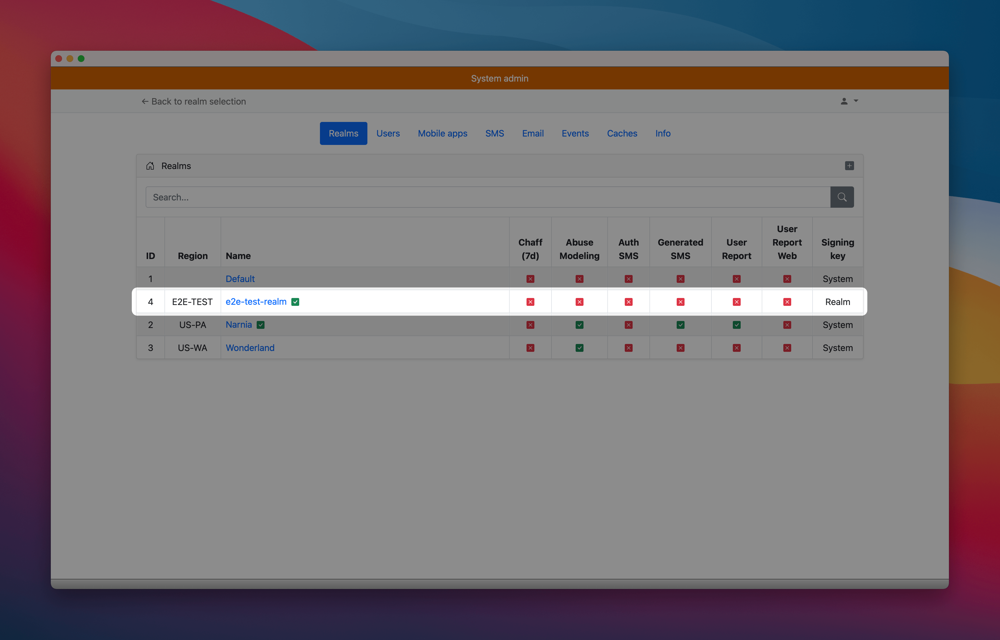

Scroll to the bottom of the page and join the realm.

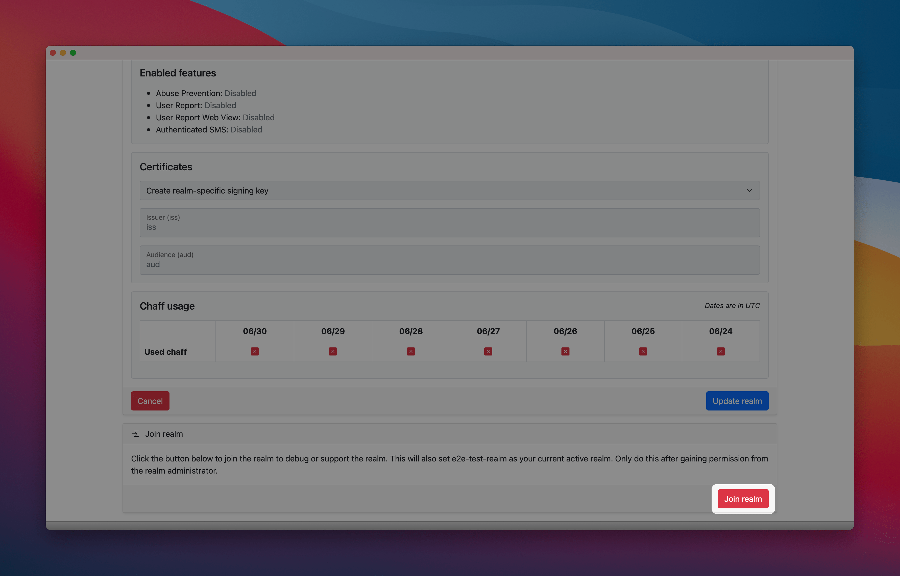

Select the "e2e-test-realm" from the realm selection menu.

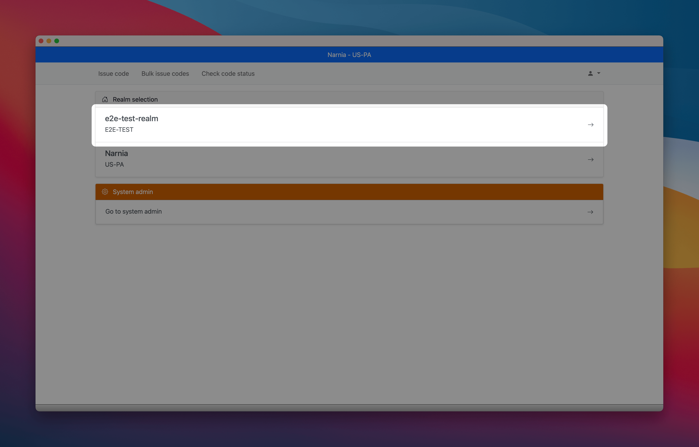

Select `Settings` from the drop down menu and select the "SMS" tab

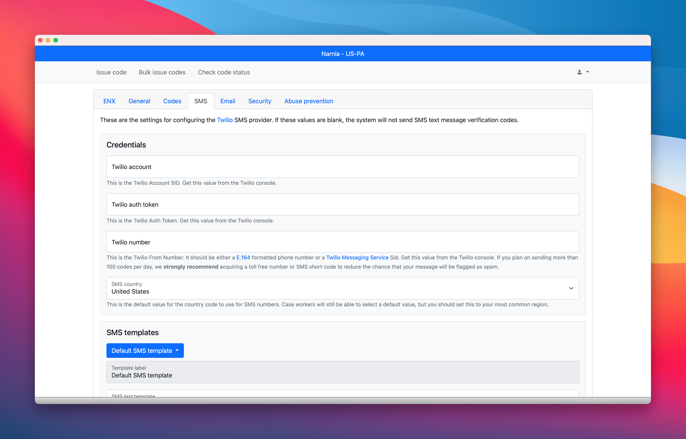

Enter your [Twilio Test Credentials](https://www.twilio.com/docs/iam/test-credentials) and the `From` number as `+15005550006`, and click "Update SMS settings".

**Do not enter your real credentials!**

If _Authenticated SMS_ is enabled for your system, configure the authenticated SMS signing key. Select "Authenticated SMS" from the drop down menu. If you do not see this option, your system has not enabled Authenticated SMS.

Click "Create new signing key version".

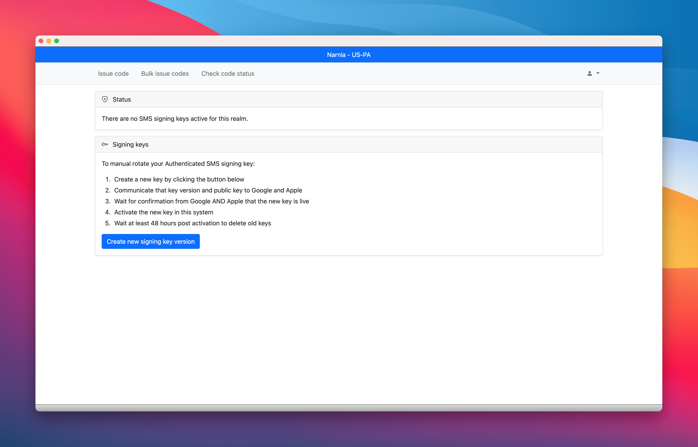

Then click "Enable Authenticated SMS".

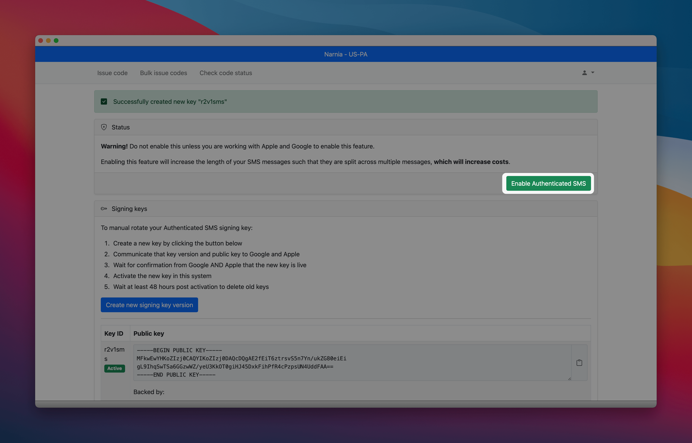

Select `Signing Keys` from the drop down menu.

Create a new (initial) realm specific signing key

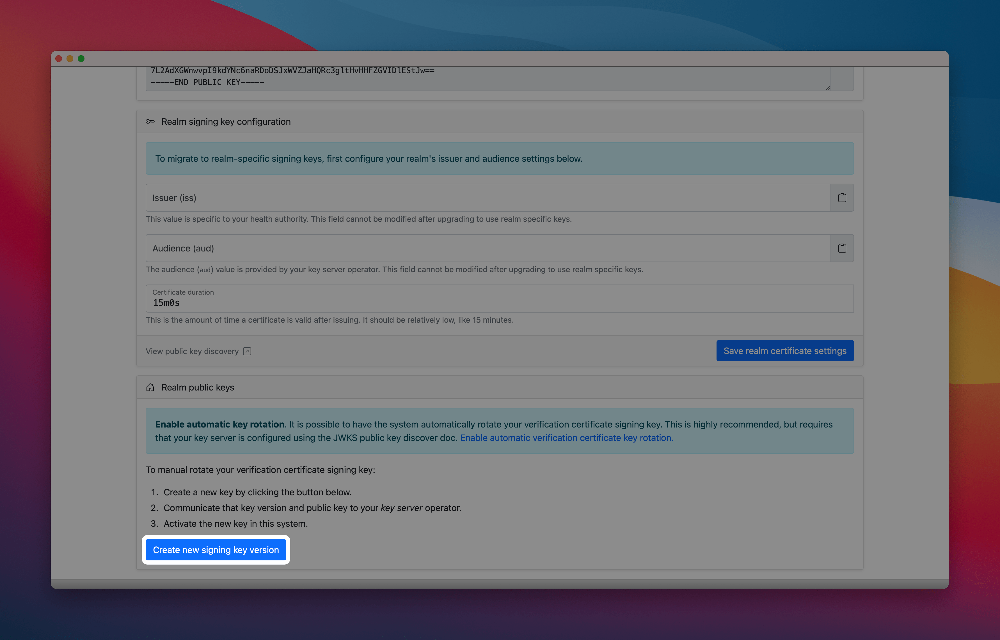

Set the issuer and audience values (`iss`/`aud`). The suggested issuer is
the reverse DNS of your verification server plus the realm (`e2e-test-realm`)
and the suggested audience value is the reverse DNS of your key server's exposure
service. You will need this information later when configuring the key server.

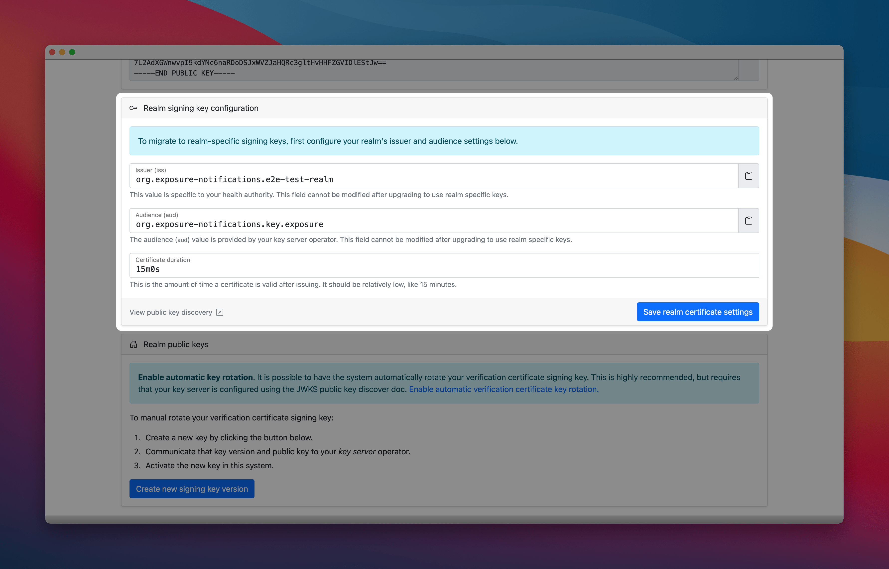

Now, upgrade to realm specific signing keys for this realm.

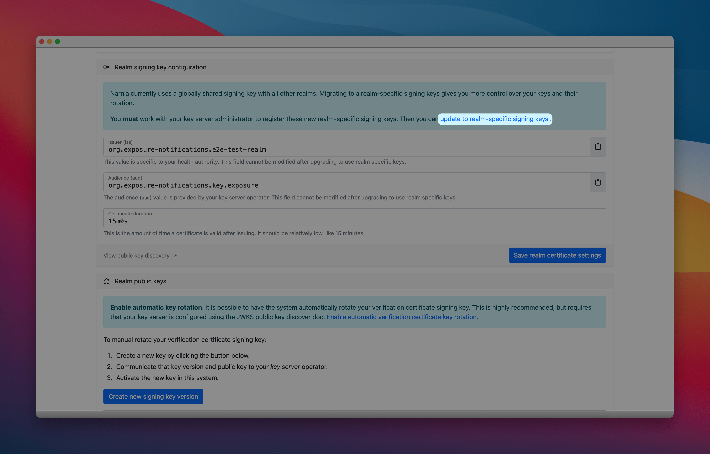

Moving on to the key server. Connect to your key server instance
and run the admin console. Create a new verification key.

Set the name, issuer, audience and JWKS URI in the configuration.

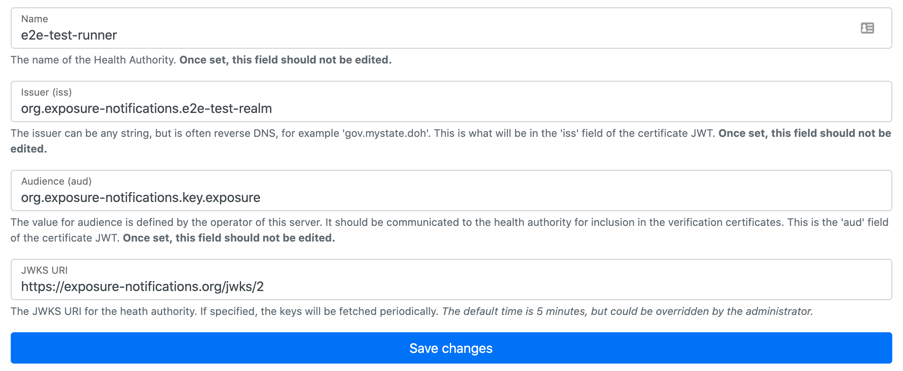

Navigate back to the admin console home, and then click back into the
newly created verification key config. Refresh this page until the JWKS
importer has picked up the public key.

When that is ready, navigate back to the admin console home and create a new
authorized health authority. Set the Health Authority ID to `e2e-test-only`, set
the regions to something your system is not using, and select the matching
certificate value.

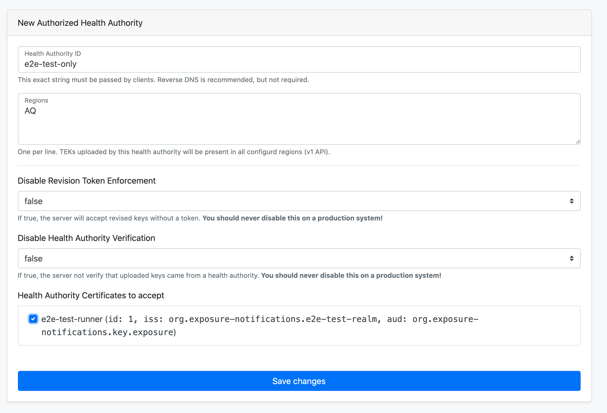

Wait 5 minutes (cache refresh at exposure service), and then force the end to end
workflows to run (verification Cloud Scheduler).


If the workflows move to `success`, then you have done everything correctly!

## Architecture

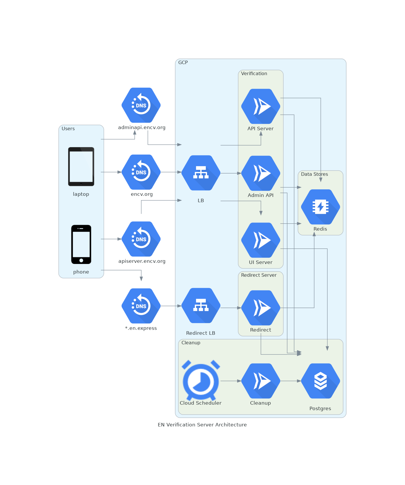
