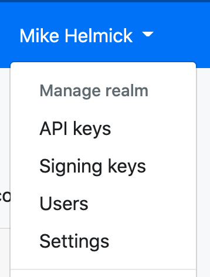
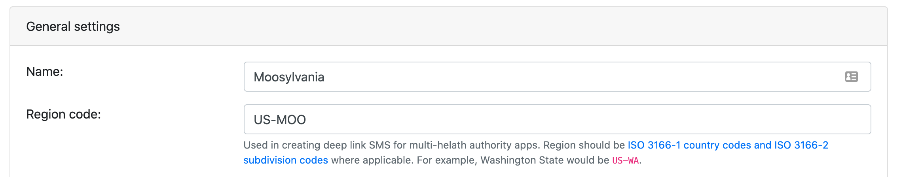
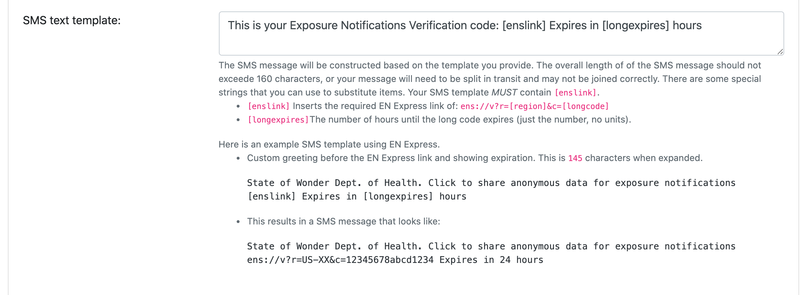
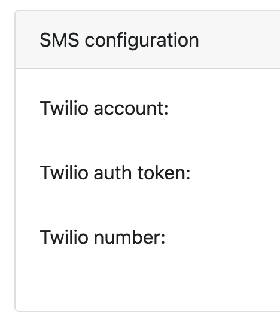
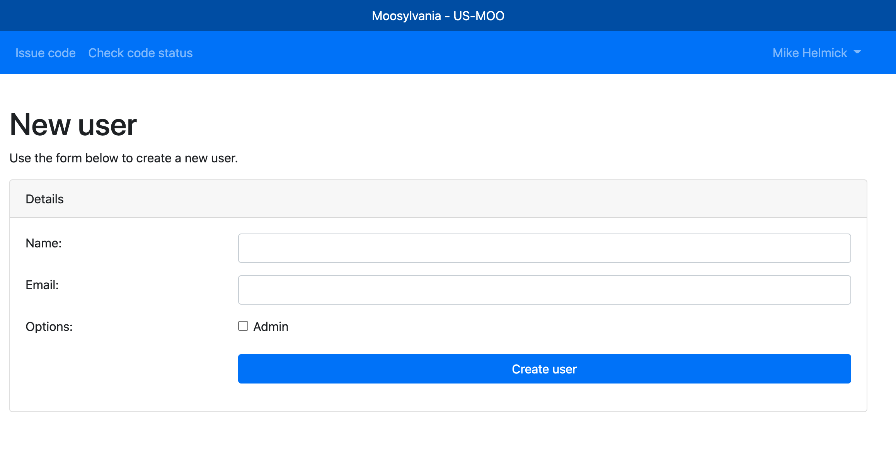
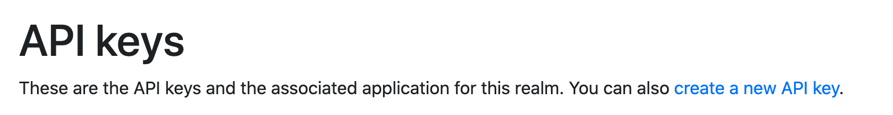
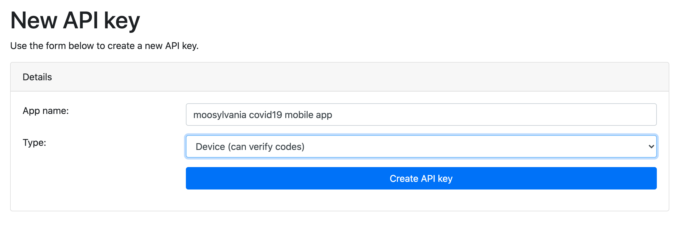
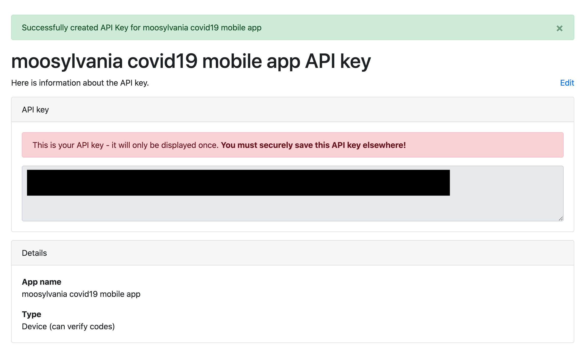
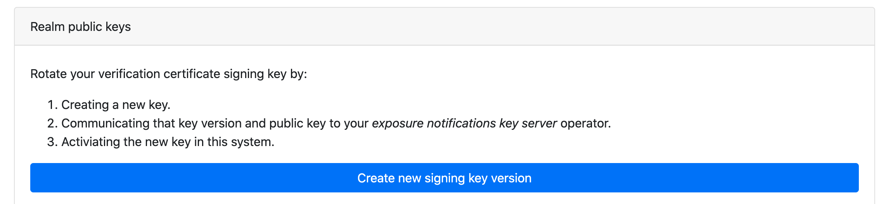
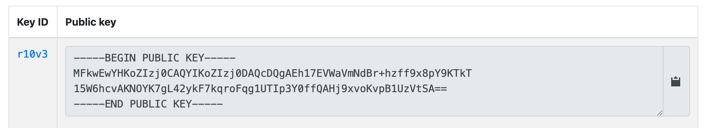

# Realm admin guide

This guide provides high-level steps for realm administrators to follow.

If you are not a realm administrator, you will not have access to these screens.

## Access protection recommendations

### Account protection

We provide a base level of account protection measures that we urge you to share with your caseworkers that are issuing verification codes.

* All user accounts must verify ownership of their email address before using the system.
* Two-factor authentication (2FA) is available, we strongly suggest you require your users to enroll in 2FA
  using a mobile device under their sole control.
* Users should not share logins to the verification system.
* Users should only issue codes to people who have a verified COVID-19 diagnosis.

Realm administrators should monitor the number of codes issued and take corrective action if needed (suspend a user's access to issue codes)

### API key protection

* API keys should not be checked into source code.
* ADMIN level API Keys can issue codes, these should be closely guarded and their access should be monitored. Periodically, the API key should be rotated.

## Settings, enabling EN Express

Go to the realm setting by selecting the `settings` drop down menu (shown under your name).

Under general settings, confirm the `Name` (display name only) and `Region code` settings.

The region code is important for `EN Express` customers and must match the
[ISO 3166-1 country codes and ISO 3166-2 subdivision codes](https://en.wikipedia.org/wiki/List_of_ISO_3166_country_codes)
for the geographic region that you cover.

Once that is confirmed and saved, click the `Enable EN Express` button.

After you have enabled EN Express, it is possible to customize the text of the SMS message that gets sent to patients.
See the help text on that page for guidance.

## Settings, Twilio SMS credentials

To dispatch verification codes / links over SMS, a realm must provide their credentials for [Twilio](https://www.twilio.com/). The necessary credentials (Twilio account, auth token, and phone number)
must be obtained from the Twilio console.

## Adding users

Go to realm users admin by selecting 'Users' from the drop-down menu (shown under your name).

Add users, by clicking on `create a new user`.

Enter the name of the user and the email address to add. The email address will need to be verified on the person's first login.

The admin checkbox indicates if this person should be made a realm admin (same powers that you have).
If a user only needs to be able to issue verification codes, they do not need to be a realm admin.

## API Keys

API Keys are used by your mobile app to access the verification server.
These API keys should be kept secret and only used by your mobile app.

Click the link to create a new API key.

Enter a name that indicates what this API key is for and select the type.
The `Device` type is the one that is needed by mobile apps.

When ready, click the `Create API key` button.

Once the API key is created, it will be displayed to you.
This is the __only__ time that this API key will be displayed.
If you fail to copy it, you will need to create another one.

## Rotating certificate signing keys

Periodically, you will want to rotate the certificate signing key for your verification certificates.

This is done from the 'Signing Keys' screen.

### Step 1 - Create a new signing key version

Click the "Create a new signing key version" button. This will _create_ but not make active a new key.

If successful, you will get a message indicating the new key version that was created.

This keyID and the public key need to be communicated to your key sever operator.

When your key server operator confirms that this key is configured, you can click 'Activate.'

15 minutes after activating the new key, you can destroy the old version.
__Caution__: destroying the old key too early it may invalidate already issued, and still valid, certificate tokens.
