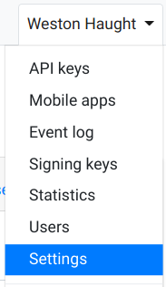
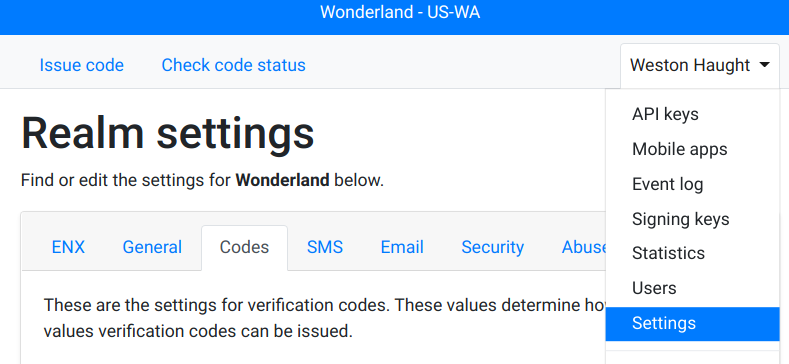
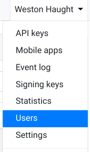
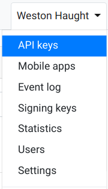
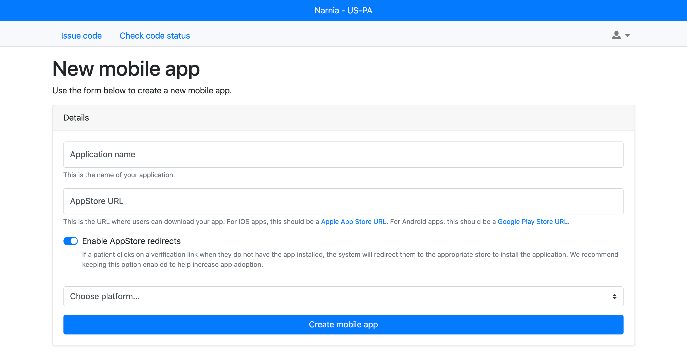
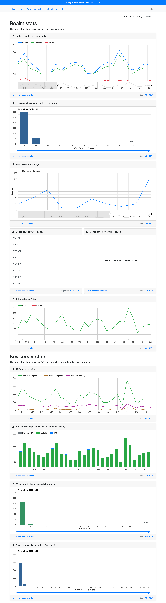
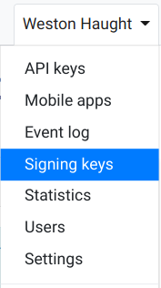
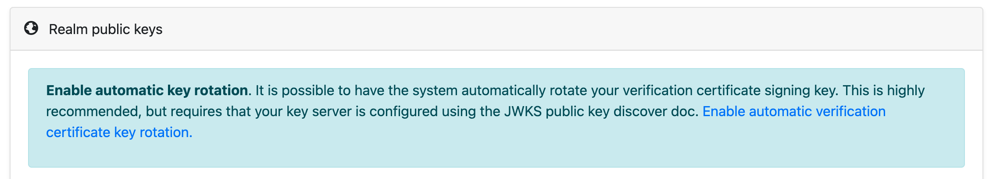
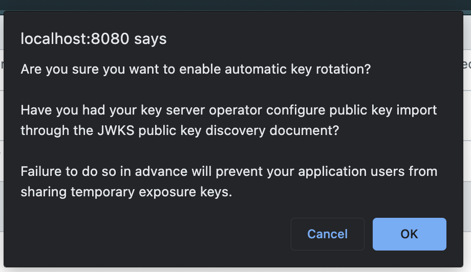
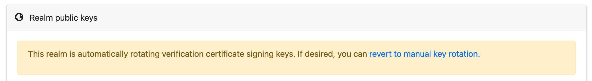

<!-- TOC depthFrom:2 -->

- [Access protection recommendations](#access-protection-recommendations)
  - [Account protection](#account-protection)
  - [API key protection](#api-key-protection)
- [Settings, enabling EN Express](#settings-enabling-en-express)
- [Settings, code settings](#settings-code-settings)
  - [Bulk Issue Codes](#bulk-issue-codes)
  - [Allowed Test Types](#allowed-test-types)
  - [Date Configuration](#date-configuration)
  - [Code Length & Expiration](#code-length--expiration)
  - [SMS Text Template](#sms-text-template)
- [Settings, Twilio SMS credentials](#settings-twilio-sms-credentials)
- [Adding users](#adding-users)
- [API keys](#api-keys)
- [ENX redirector service](#enx-redirector-service)
- [Mobile apps](#mobile-apps)
- [Statistics](#statistics)
  - [Key server statistics](#key-server-statistics)
- [Rotating certificate signing keys](#rotating-certificate-signing-keys)
  - [Automatic Rotation](#automatic-rotation)
  - [Manual Rotation](#manual-rotation)

<!-- /TOC -->

# Realm admin guide

This guide provides high-level steps for realm administrators to follow.

If you are not a realm administrator, you will not have access to these screens.

## Access protection recommendations

### Account protection

We provide a base level of account protection measures that we urge you to share with your caseworkers that are issuing verification codes.

* All user accounts must verify ownership of their email address before using the system.
* Two-factor authentication (2FA) is available, we strongly suggest you require your users to enroll in 2FA
  using a mobile device under their sole control.
* Users should not share logins to the verification system.
* Users should only issue codes to people who have a verified COVID-19 diagnosis.

A member of the realm should be responsible for monitoring the number of codes issued and take corrective action (including user account suspension) for abuse. Realm administrators can also enable Abuse Prevention.


### API key protection

* API keys should not be checked into source code.
* ADMIN level API Keys can issue codes, these should be closely guarded and their access should be monitored. Periodically, the API key should be rotated.


## Settings, enabling EN Express

Go to the realm setting by selecting the `settings` drop down menu (shown under your name).



Under general settings, confirm the `Name` (display name only) and `Region code` settings.

The region code is important for `EN Express` customers and must match the
[ISO 3166-1 country codes and ISO 3166-2 subdivision codes](https://en.wikipedia.org/wiki/List_of_ISO_3166_country_codes)
for the geographic region that you cover.


Once that is confirmed and saved, click the `Enable EN Express` button.


## Settings, code settings

Also under realm settings `settings` from the drop down menu, there are several settings for code issuance.



### Bulk Issue Codes

  * Enabled

    A new tab is added to the realm that allows the issuance of many codes from a CSV file.
    This can be useful for case-workers who are given a data-set of test results rather than
    administering tests one-by-one.
    Details about how to bulk-issue codes [can be found here](/docs/case-worker-guide.md#bulk-issue-verification-codes).

  * Disabled

    Only the single issue-code tab will be shown. Calls to the batch issue API will fail
    for this realm.

### Allowed Test Types

  Realms may allow the following test result types from case workers.

  * Positive + Likely + Negative
  * Positive + Likely
  * Positive

  Although only `positive` and `likely` are used for matching exposure notifications on the client,
  `negative` is recommended for realms where the test result is shown to the user through the patient app.
  Showing all diagnosis - including `negative` through the app upon code issuance is a more powerful way to
  drive adoption of this system and can be more secure because the receipt of an SMS from this system does not
  reveal the diagnosis outcome.

### Date Configuration

Issuing codes have two date fields `testDate` and `symptomDate`. If this setting is marked `required`
the issuer must pass one or both of these dates. Case workers might ask for the date of symptom onset together
with the test, but when only `testDate` is given, apps are optionally recommended to prompt the user to enter
a date for first onset of symptoms - this may allow for more accurate matching of exposure.

If set to `optional`, codes may be issued successfully with no dates present.

### Code Length & Expiration

This setting adjusts the number of characters required for both long and short codes.
Realm admins may also define how long an issued code lasts before it expires. Once expired,
the patient will not longer be able to claim the diagnosis as theirs.

If EN Express is enabled, these fields are not adjustable.

Short codes are intended to be used where a case-worker may need to dictate the code to their patients
whereas long codes may be more secure for realms where they may be sent via SMS (but may be more difficult to dictate and recall).

### SMS Text Template

It is possible to customize the text of the SMS message that gets sent to patients.
See the help text on that page for guidance.


The fields `[region]`, `[code]`, `[expires]`, `[longcode]`, and `[longexpires]` may be included with brackets
which will be programmatically substituted with values. It is recommended that the text of this SMS be composed
in such a way that is respectful to the patient and does not reveal details about their diagnosis to potential onlookers of the phone's notifications with further information presented in-app.

## Settings, Twilio SMS credentials

To dispatch verification codes / links over SMS, a realm must provide their credentials for [Twilio](https://www.twilio.com/). The necessary credentials (Twilio account, auth token, and phone number)
must be obtained from the Twilio console.


## Adding users

Go to realm users admin by selecting 'Users' from the drop-down menu (shown under your name).



Add users, by clicking on the `+` in the header. If you do not see the `+`, you
do not have permission to add users.

Enter the name of the user and the email address to add. The email address will need to be verified on the person's first login.

Choose the permissions the new user should have. Since permissions are
constantly evolving, your list might be different than the one shown here. In
general, permissions take the format: `<Entity><Action>` like `UserRead` and
`UserWrite`. Read permissions are read-only and Write permissions include
create, update, and delete permissions. Always practice the Principle of Least
Privilege and only grant the most minimal set of permissions.

Note, you can only grant permissions at or below your current level.


## API keys

API Keys are used by your mobile app to access the verification server.
These API keys should be kept secret and only used by your mobile app.



Click the link to create a new API key.


Enter a name that indicates what this API key is for and select the type.
The `Device` type is the one that is needed by mobile apps.

When ready, click the `Create API key` button.


Once the API key is created, it will be displayed to you.
This is the __only__ time that this API key will be displayed.
If you fail to copy it, you will need to create another one.


## ENX redirector service

**This section is only applicable for realms that have adopted to Exposure
Notifications Express (ENX).**

The ENX redirector service performs the following primary functions:

1.  Serve a `.well-known/` directory at a public-accessible URL with files
    required by iOS and Android to properly handle app deep-links.

1.  Open your realm's mobile app on the patient's phone. Alternatively, if the
    patient does not have your mobile app installed, it can redirect them to
    your app in Apple App Store or Android Play Store automatically based on the
    device type.

In order for your mobile apps to consume this functionality, you need to create
mobile app records on your realm. Note this is **different** from an _API key_.
Creating a mobile app is documented below.

If your system supports the ENX redirector service, the system administrator
should share your redirect domain. Typically this is comprised of your realm's
_region code_ and a base domain, like:

```text
https://<region-code>.<domain>

# Example:
https://us-ca.enexpress.com
```

Your system administrator defines the root domain. You can use URLs with this
domain on mobile devices. As mentioned above, if the patient has your app
installed, the URL will deep-link into the application. If the patient does not
have your app installed, they will be redirected to the appropriate app store
and prompted to install.

## Mobile apps

**You must have `MobileAppWrite` permissions to perform these steps.**

To create a new mobile app, visit the `/realm/mobile-apps` URL. You can access
it directly via:

```text
https://<your-domain>/realm/mobile-apps
```

Or by choosing "Mobile apps" from the dropdown.


Click the "+" to launch the New Mobile Apps page.



Complete the information for your mobile app. Depending on the platform (iOS or
Android), you may be required to enter different information. Click "Create
mobile app" to save the entry.

Once the mobile app has been created, it can take up to 30 minutes for the ENX
redirector service to create your entry.

Note that this process is separate from the Google and Apple app review
processes. You still must submit your application for inclusion in the Play
Store and App Store respectively, separate from this system.


## Statistics

The verification server provides statistics for various facets of the system.
Most statistics are also available [via the API](api.md).

### Key server statistics

Some statistics are automatically collected, while other  statistics require
opt-in consent. The system automatically collects information about the number
of codes issued, codes claimed, and error rates.

You can optionally enable
enhanced statistics collection from the corresponding key server. **Enabling these statistics may require an update to your application's privacy policy or data handling agreement.** If enabled, enhanced statistics include information such as:

- Total number of TEKs published: the total number of TEKs that have been
  published to the key server (per day).

- Requests with revisions: the total number of uploads that contained at least one TEK revision.

- Requests missing onset: the total number of uploads where no onset date was provided.

- Requests by operating system: a breakdown of requests by target operating
  system (Android and iPhone).

- TEK age distribution: this shows a distribution of the ages of TEKs by how
  many days old each TEK is.

- Onset upload distribution: reflects the distribution of the time between the
  TEK's symptom onset time and when the key was uploaded.

Here is an example of the statistics page:



## Rotating certificate signing keys

Periodically, you will want to rotate the certificate signing key for your verification certificates.

This is done from the 'Signing Keys' screen. There are two modes of operation (1) automatic rotation
and (2) manual rotation. If your key server supports it, automatic rotation is recommended.



### Automatic Rotation

🛑 ⚠️ **WARNING** Before moving forward, please ensure that your key sever is configured
to use your realm's public key discovery (JWKS) document. **Failure to do so will make it so
your application users will not be able to share their keys.**

Once you have confirmed that public key discovery is set up directly, click the "Enable automatic
verification certificate key rotation." link (as pictured below).



You will then be asked to confirm that pubic key discovery is set up correctly.



When automatic rotation is enabled, the "Realm public keys" section will be changed to:



If you visit this page ever 30d, you should see that there is a different set of available/active
public keys.

The first rotation will start between 60 and 90 minutes after you enable rotation.

### Manual Rotation

Click the "Create a new signing key version" button. This will _create_ but not make active a new key.


If successful, you will get a message indicating the new key version that was created.


This keyID and the public key need to be communicated to your key sever operator.


When your key server operator confirms that this key is configured, you can click 'Activate.'

15 minutes after activating the new key, you can destroy the old version.
__Caution__: destroying the old key too early it may invalidate already issued, and still valid, certificate tokens.
