<!-- TOC -->autoauto- [System admin guide](#system-admin-guide)auto  - [Account setup](#account-setup)auto  - [Inviting new admins](#inviting-new-admins)auto  - [Creating new realms](#creating-new-realms)auto  - [View realm information](#view-realm-information)auto  - [Joining realms](#joining-realms)auto  - [Create system SMS configuration](#create-system-sms-configuration)auto  - [Create system SMTP configuration](#create-system-smtp-configuration)auto  - [Clearing caches](#clearing-caches)auto  - [Getting system information](#getting-system-information)autoauto<!-- /TOC -->

# System admin guide

This guide describes common system administration tasks. Note this is different
from infrastructure administration. System administrators are super users of the
system and are responsible for creating realms and configuring system-level
parameters that apply to all realms.

## Account setup

To become a system admin, an existing system admin must invite you to join. You
will receive an email notification. If you are already a member of the system
(as a non-system admin), you will be promoted. If you are not already a member
of the system, an account will be provisioned automatically and you will be
prompted to reset your password.

## Inviting new admins

As a system admin, you can invite new system admins. Before inviting a system
admin, perform due diligence to ensure the user requires admin permissions.
System-level administration is very a privileged role and should only be
delegated to trusted users.

To invite a new system admin, visit the `/admin/users` URL. You can access it
directly via:

```text
https://<your-domain>/admin/users
```

Or by choosing "System admin" from the dropdown and selecting the "Users" tab.

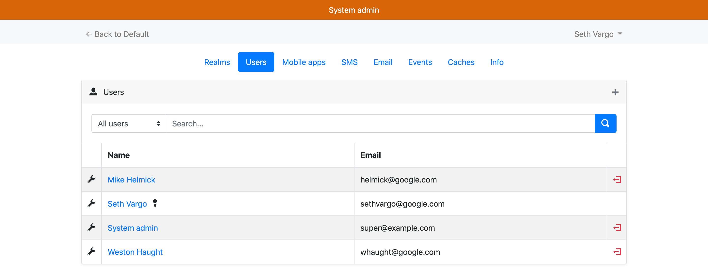

Click the "+" to launch the New System Admin page.

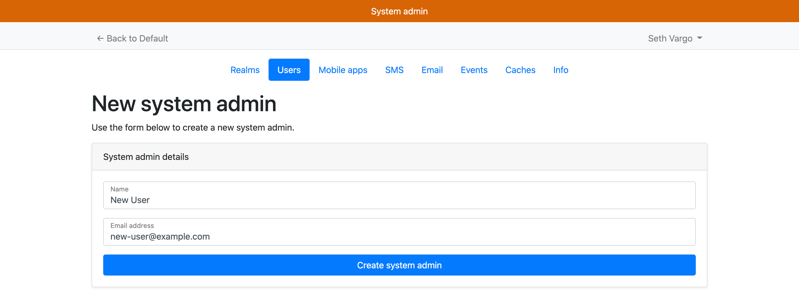

Click "Create System Admin" to create the user. If the user already exists in
the system, they will be promoted. Otherwise, an account will be automatically
provisioned and they will receive an email with password reset instructions.

## Creating new realms

To create a new realm for a health authority, visit the `/admin/realms` URL. You
can access it directly via:

```text
https://<your-domain>/admin/realms
```

Or by choosing "System admin" from the dropdown and selecting the "Realms" tab.

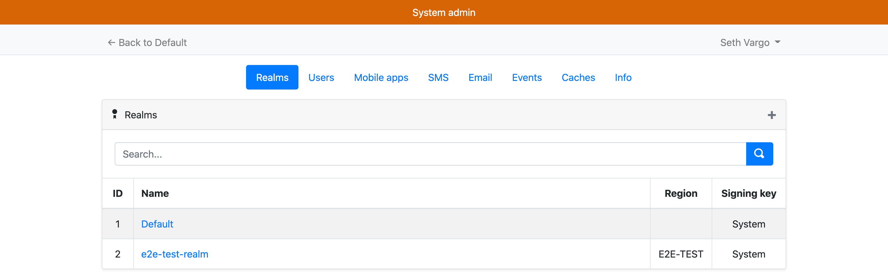

Click the "+" to launch the New Realm page. **Realms cannot be deleted!**

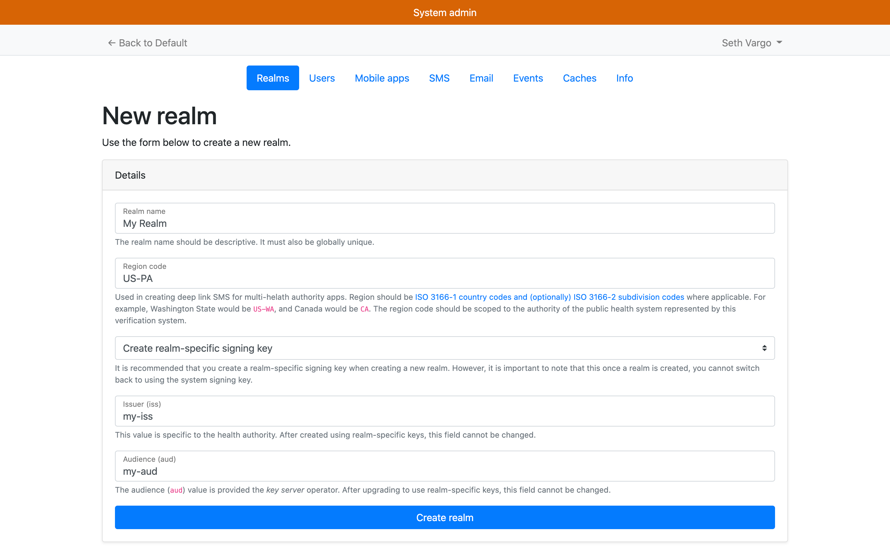

The realm should provide you the values for the `iss` and `aud` values, and
these values must match what is supplied to the key server.

Note that must realm properties are immutable after creation!

## View realm information

As a system administrator, you can view high-level realm information such as
abuse prevention statistics, recent events, and mobile apps. To view high-level
realm information, visit the `/admin/realms` URL. You can access it directly
via:

```text
https://<your-domain>/admin/realms
```

Or by choosing "System admin" from the dropdown and selecting the "Realms" tab.


Click on the realm name in the realms list view:

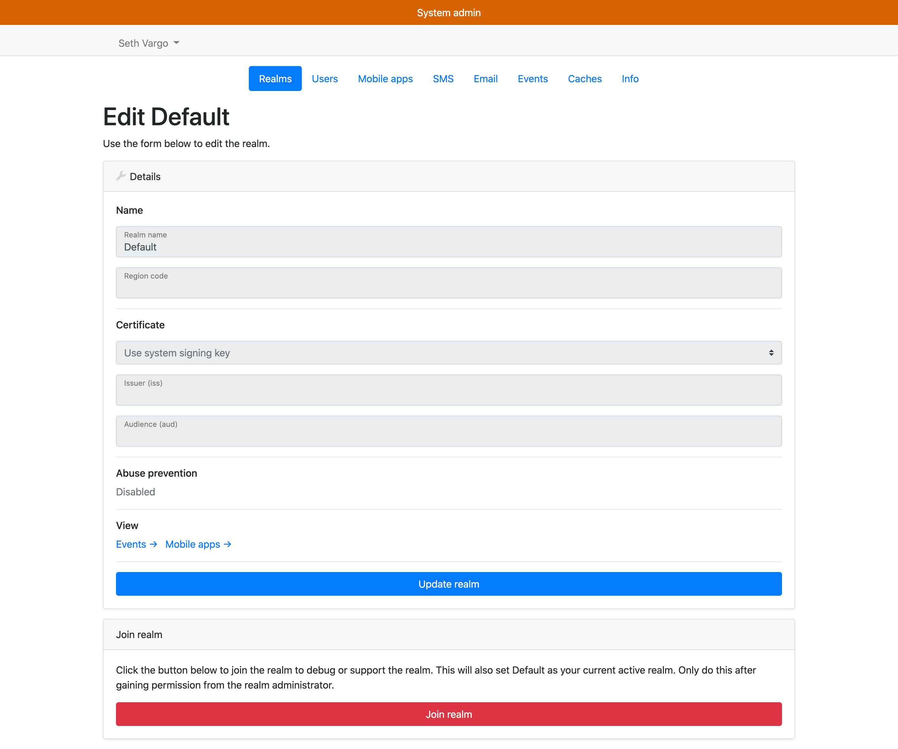

You can see abuse prevention statistics and deep links to events and mobile apps
for this realm. You do **not** need to join the realm to see this data.

## Joining realms

As a system administrator, you can join a realm as a realm administrator to help
debug issues like misconfigurations. To join a realm as an administrator, visit
the `/admin/realms` URL. You can access it directly via:

```text
https://<your-domain>/admin/realms
```

Or by choosing "System admin" from the dropdown and selecting the "Realms" tab.


Click on the realm name in the realms list view:


Scroll to the bottom and click "Join realm". **This event is audited and
logged!**

## Create system SMS configuration

The system can optionally provide a system-level SMS configuration and then
share that configuration on a per-realm basis. Even if a system-level SMS
configuration is defined, individual realms can still provide their own
configurations. To provide a system-level SMS configuration, visit the
`/admin/sms` URL. You can access it directly via:

```text
https://<your-domain>/admin/sms
```

Or by choosing "System admin" from the dropdown and selecting the "SMS" tab.

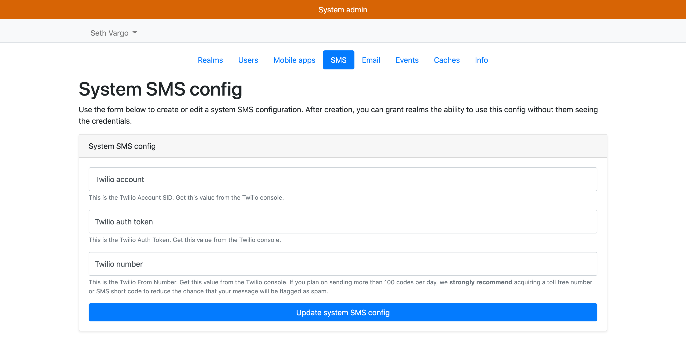

Complete the information for the [Twilio](https://twilio.com) credentials and
click the "Update system SMS config" button.

Upon saving the system SMS configuration, the "New realm" and "Realm show" pages
will have a new optional setting to share this system SMS configuration with
that realm.

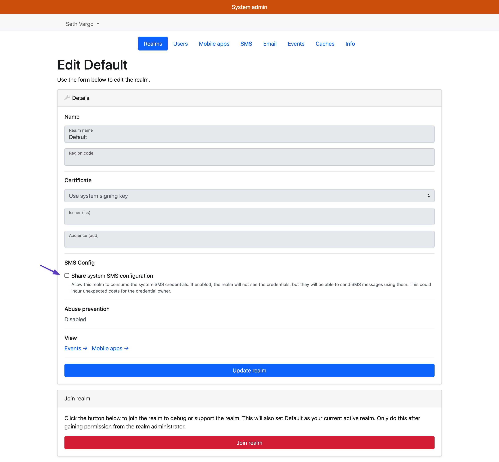

## Create system SMTP configuration

The system can optionally provide a system-level email configuration and then
share that configuration on a per-realm basis. Even if a system-level email
configuration is defined, individual realms can still provide their own
configurations. To provide a system-level email configuration, visit the
`/admin/email` URL. You can access it directly via:

```text
https://<your-domain>/admin/email
```

Or by choosing "System admin" from the dropdown and selecting the "Email" tab.

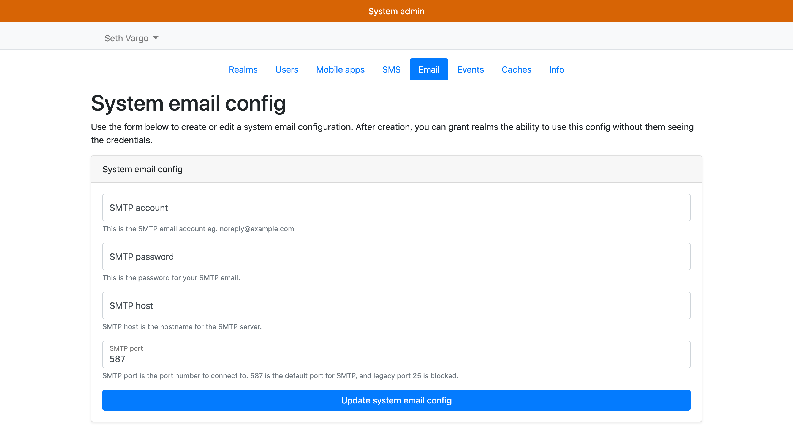

Complete the information for the SMTP credentials.

Upon saving the system email configuration, the "New realm" and "Realm show"
pages will have a new optional setting to share this system email configuration
with that realm.

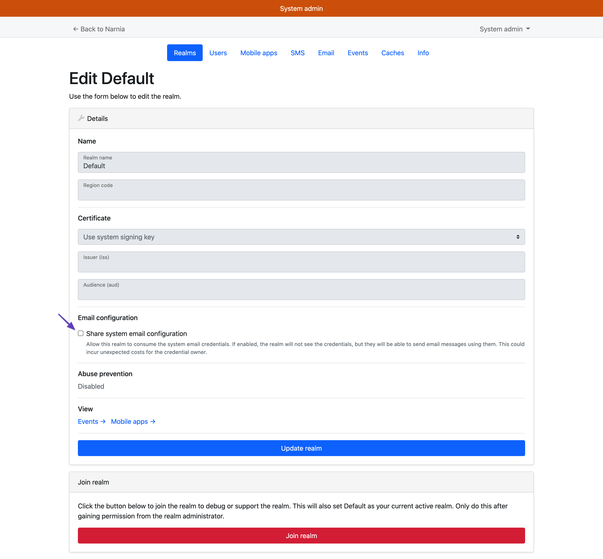

## Clearing caches

In some situations, it may be beneficial to clear certain cached data in the
system. For example, if a health authority pushes out a bad configuration, it
may be cached for up to 30 minutes. System administrators can clear various
caches. To clear caches, visit the `/admin/caches` URL. You can access it
directly via:

```text
https://<your-domain>/admin/caches
```

Or by choosing "System admin" from the dropdown and selecting the "Caches" tab.

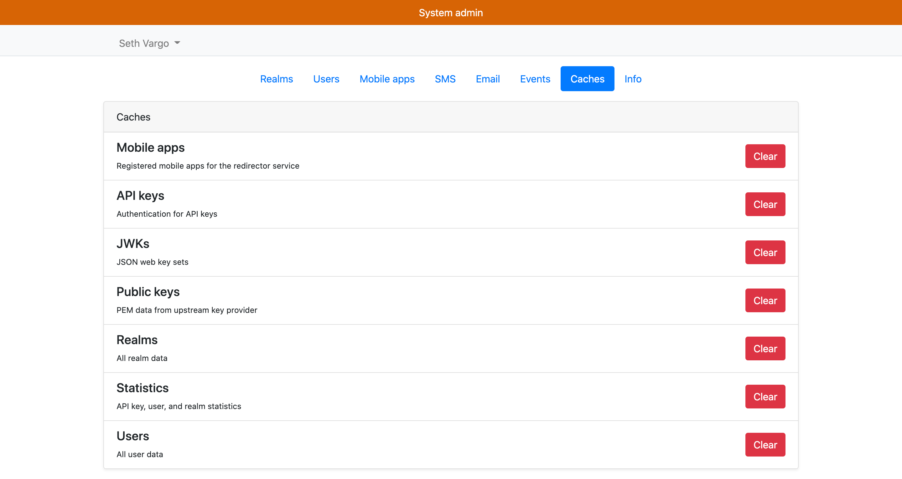

Each cache is self-described under the name. Press the big red button to clear
the cache. You will be prompted to confirm.

## Getting system information

In some situations, the server engineering team may request build information for your system. To access the build information, visit the `/admin/info` URL. You can access it
directly via:

```text
https://<your-domain>/admin/info
```

Or by choosing "System admin" from the dropdown and selecting the "Info" tab.

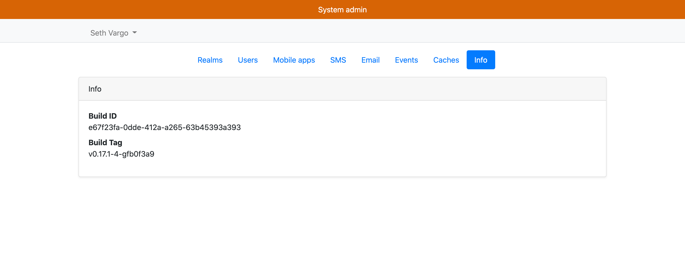

Supply this information when requested.
